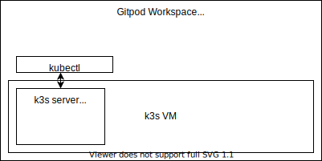

# A K3S template on Gitpod

This is a [k3s](https://k3s.io//) template configured for ephemeral Kubernetes development environments on [Gitpod](https://www.gitpod.io/).

## Next Steps

Click the button below to start a new development environment:

[](https://gitpod.io/#https://github.com/gitpod-io/template-k3s)

## Get Started With Your Own Project

### A new project

Click the above "Open in Gitpod" button to start a new workspace. Once you're ready to push your first code changes, Gitpod will guide you to fork this project so you own it.

### An existing project

To get started with k3s on Gitpod, copy the `.gitpod.yml` and the `.gitpod` folder to your own project. To learn more, please see the [Getting Started](https://www.gitpod.io/docs/getting-started) documentation.

## Notes & caveats


Here's a diagram of the interactions that also shows how the various components interact with each other.

<center>



</center>

## Usage

At start, the workspace will start a VM in your gitpod workspace and
automatically install k3s on it. Your local environment will be automatically
configured to use that via the `kubectl`


### Connecting via kubectl

When you open your workspace terminal, the `kubectl` is already configured for you
via the `~/.kube/config` file.

### Kubectl from my local terminal


### Connecting via SSH

You can connect to the VM via ssh at any moment. The ssh daemon
is exposed on `127.0.0.1` for the workspace on port `2222`.

- username: root
- password: root

```console
ssh -p 2222 root@127.0.0.1
```

You can use the `.gitpod/ssh.sh` and `.gitpod/scp.sh` scripts if you want to
avoid the extra steps.
